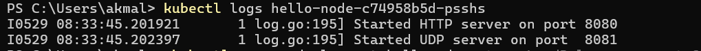
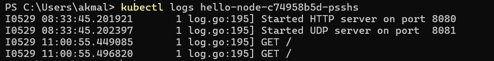
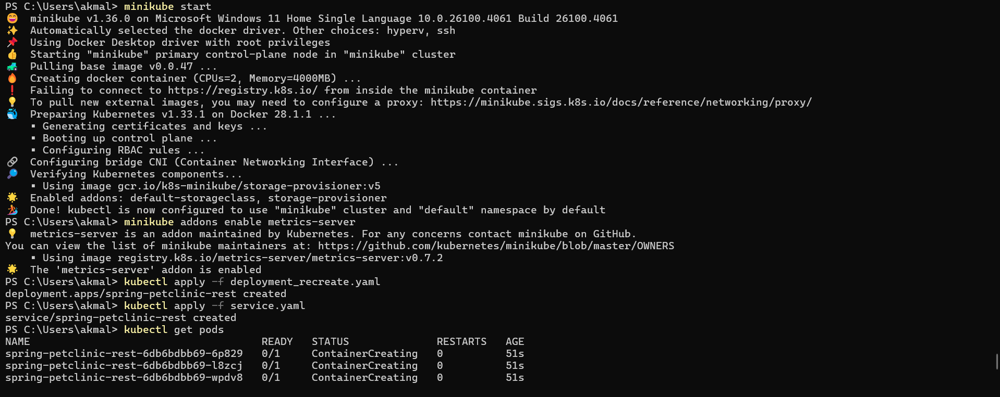
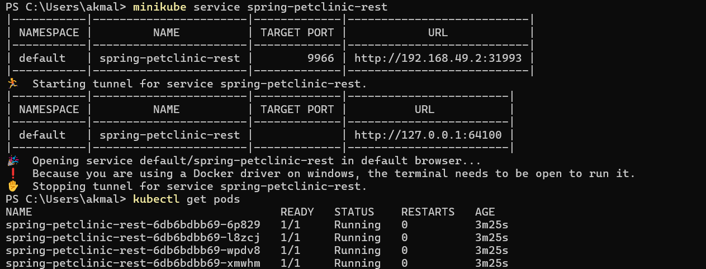
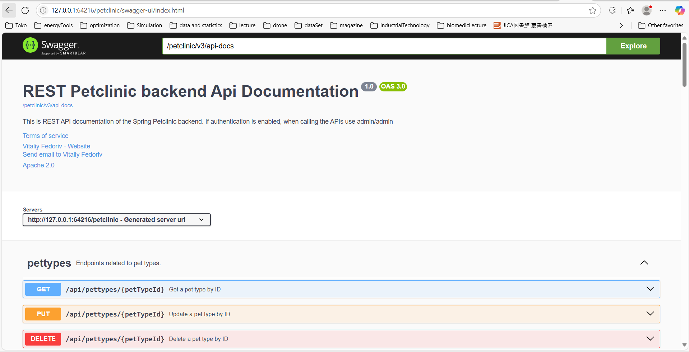

## AdvProg - Tutorial Module 11
<h2>
Nama   : Muhammad Akmal Abdul Halim

Kelas  : B

NPM    : 2306245125
</h2>

## Reflection on Hello Minikube

1. Compare the application logs before and after you exposed it as a Service.
Try to open the app several times while the proxy into the Service is running.
What do you see in the logs? Does the number of logs increase each time you open the app?

Pada gambar pertama, terlihat hanya ada log inisialisasi aplikasi:


Ini menunjukkan bahwa aplikasi telah berhasil dimulai dan server HTTP dan UDP telah diinisialisasi pada port masing-masing, tetapi belum ada traffic masuk karena layanan belum diekspos ke luar.

Pada gambar kedua, terlihat log yang sama dengan tambahan log baru:


Setelah layanan diekspos menggunakan perintah minikube service hello-node, terlihat adanya permintaan GET yang masuk ke aplikasi. Ini ditandai dengan munculnya entri log baru pada pukul 11:00:55, yang merekam permintaan HTTP GET ke path root ("/").

Perbedaan log ini dengan jelas menunjukkan bahwa setelah layanan diekspos ke luar menggunakan Kubernetes Service, aplikasi mulai menerima traffic eksternal yang dibuktikan dengan adanya permintaan GET. Jarak waktu yang cukup signifikan antara inisialisasi aplikasi (08:33) dan permintaan pertama (11:00) menggambarkan rentang waktu ketika Service diekspos dan kemudian diakses dari luar cluster Kubernetes.


2.  Notice that there are two versions of `kubectl get` invocation during this tutorial section. The first does not have any option, while the latter has `-n` option with value set to `kube-system`.

Dalam Kubernetes, flag -n pada perintah kubectl get berfungsi untuk menyebutkan namespace tertentu yang ingin diperiksa. Fitur ini sangat membantu terutama saat mengelola cluster yang memiliki beberapa service dengan penamaan identik di namespace yang berbeda-beda.

Apabila perintah kubectl get dijalankan tanpa menyertakan flag -n, sistem secara otomatis hanya akan menampilkan resource dari namespace default. Hal ini terjadi karena namespace pada Kubernetes dirancang sebagai mekanisme untuk memisahkan dan mengorganisir resource dalam sebuah cluster.

Ketika kita menambahkan parameter -n kube-system pada perintah, kubectl akan secara khusus menampilkan komponen-komponen sistem inti Kubernetes seperti layanan DNS dan server API yang berada dalam namespace tersebut.

Sebaliknya, jika kita tidak menggunakan opsi -n sama sekali, hasil yang ditampilkan hanya akan mencakup resource-resource yang telah dibuat oleh pengguna secara manual dalam namespace default.

3.  What is the purpose of the `-n` option and why did the output not list the pods/services that you explicitly created?

Perbedaan utama antara strategi Rolling Update dan Recreate pada Kubernetes berfokus pada ketersediaan aplikasi selama proses pembaruan.

Saat menggunakan strategi Recreate, sistem akan menghentikan seluruh pod versi lama terlebih dahulu sebelum menciptakan pod dengan versi terbaru. Akibatnya, terjadi periode ketidaktersediaan layanan atau downtime selama transisi tersebut berlangsung.

Di sisi lain, Rolling Update mengadopsi pendekatan bertahap yang menjaga ketersediaan aplikasi. Dengan metode ini, pod-pod baru dihadirkan secara bergantian sambil tetap mempertahankan pod versi lama yang masih aktif. Pendekatan ini memastikan aplikasi tetap dapat diakses oleh pengguna selama proses pembaruan, sehingga menghindari terjadinya downtime.

##  Reflection on Rolling Update & Kubernetes Manifest File

1. What is the difference between Rolling Update and Recreate deployment strategy?

Strategi Rolling Update dan Recreate Deployment di Kubernetes memiliki perbedaan mendasar dalam hal ketersediaan aplikasi saat pembaruan berlangsung.

Ketika mengimplementasikan Recreate Deployment, terjadi periode nonaktif karena seluruh pod versi sebelumnya dimatikan terlebih dahulu sebelum meluncurkan pod dengan versi baru. Hal ini mengakibatkan layanan tidak dapat diakses sementara waktu selama proses pembaruan.

Sementara itu, Rolling Update menawarkan pendekatan yang lebih mulus dengan menghindari downtime. Strategi ini menerapkan pembaruan secara bertahap dimana pod-pod baru dibuat satu demi satu sambil mempertahankan pod lama tetap berfungsi. Dengan metode ini, aplikasi tetap dapat melayani permintaan tanpa gangguan sepanjang proses pembaruan berlangsung.

2. Try deploying the Spring Petclinic REST using Recreate deployment strategy and document your attempt.




Akses endpoint /petclinic



3. Prepare different manifest files for executing Recreate deployment strategy.

Pada bagian sebelumnya, saya telah melakukan serangkaian proses dengan memanfaatkan berkas manifes yang saya namai deployment_recreate.yaml. Untuk membuat berkas tersebut, saya melakukan modifikasi terhadap berkas deployment.yaml yang sudah ada sebelumnya, dengan perubahan utama pada bagian strategi pembaruan dari RollingUpdate menjadi Recreate.
```kubernetes
   strategy:
     type: Recreate
```

4. What do you think are the benefits of using Kubernetes manifest files? Recall your experience in deploying the app manually and compare it to your experience when deploying the same app by applying the manifest files (i.e., invoking kubectl apply -f command) to the cluster.

Berdasarkan pengamatan saya, implementasi berkas manifes memberikan keunggulan signifikan berupa minimalisasi potensi kesalahan yang dilakukan oleh developer ketika menjalankan proses deployment aplikasi. Tahapan-tahapan deployment secara terstruktur telah terdokumentasi dengan baik dalam berkas manifes tersebut. Dengan pendekatan ini, pengelolaan konfigurasi aplikasi ke depannya tidak perlu lagi dilaksanakan secara manual, sehingga meningkatkan efisiensi dan konsistensi dalam lingkungan pengembangan.